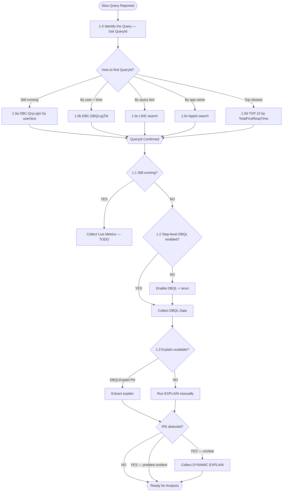

# Teradata Query Performance Diagnosis

> **Tool Usage — Gateway Pattern (READ THIS FIRST):**
> - The ONLY callable tool is **`teradata_tool_call`** — activate and call this tool directly
> - `base_readQuery` is NOT a tool — it is an operation name you pass INSIDE `teradata_tool_call`
> - **Correct call:** `teradata_tool_call(input='{"name": "base_readQuery", "parameters": {"query": "SELECT ..."}}')`
> - **Setup:** `tool_search("teradata_tool_call")` → `activate_tool(mcp_server=<from results>, tool_name="teradata_tool_call")` → call it
> - NEVER call `activate_tool` with tool_name `base_readQuery` — that will fail with tool_not_found
> - NEVER search for `base_readQuery` as a tool — it does not exist as a standalone tool
> - Do NOT hardcode a server name — use whichever `mcp_server` appears in `tool_search` results
>
> **CRITICAL — Reference-First Diagnostic Pattern:**
> Before executing ANY SQL query, you MUST first read the reference file
> `references/dbql-tables-and-patterns.md` to select the correct table, columns, and
> query pattern for the user's scenario. This ensures you query the right DBQL table
> (e.g., `DBC.QryLogV` for still-running queries vs `DBC.DBQLogTbl` for completed ones).
> After reading the reference, immediately execute the appropriate diagnostic SQL —
> do NOT ask clarifying questions if the user has provided enough context (username,
> table name, time window, application name). Return real results, not documentation.

Guide a DBA or developer through diagnosing a slow-running Teradata query. Follow the
decision tree step by step — collect the right data, interpret it correctly, and navigate
to the root cause without shortcutting.

## When to Use

- User reports a slow query or long-running SQL
- User wants to find root cause of poor query performance
- User needs help interpreting DBQL step data or explain plans
- User suspects missing or stale statistics are causing bad plans
- User wants to check whether indexes are being used correctly
- User needs to analyze cardinality estimation errors in complex queries
- User asks to "diagnose a slow query", "why is my query slow", "check query performance"
- User wants to find a query by username, table name, or application name
- User wants to see the slowest or longest-running queries for a user
- User needs to interpret an explain plan showing unexpected access paths
- User sees "all-rows scan", "all-AMPs RETRIEVE", or suspects a full table scan
- User asks about data skew, "duplicate on all AMPs", or value-level hotspots
- User wants to diagnose slow ETL or batch job performance on Teradata
- User asks about Join Index (JI) or Aggregate Join Index (AJI) usage
- Trigger phrases: "slow query", "query performance", "bad explain plan", "missing stats",
  "full table scan", "wrong index", "cardinality estimation", "DBQL analysis",
  "find my query", "slowest queries", "long running", "query log", "explain plan",
  "explain shows", "all-rows scan", "data skew", "duplicate on all AMPs",
  "row estimate", "optimizer picked", "ETL slow", "running query", "query took too long"

## Ground Rules

- **Follow steps sequentially within a branch.** Each step's output is the entry condition
  for the next. Do not skip ahead based on pattern matching or assumptions.
- **Cross-branch navigation is valid** when evidence points to a different root cause.
  State the reason clearly and re-enter the appropriate branch from its gate.
- Mark any branch labeled `[ TODO ]` as out of scope and tell the user it will be
  addressed in a future version.
- This is an iterative process — some fixes (e.g., stats collection) require re-running
  EXPLAIN and re-evaluating.
- Changes to statistics affect ALL queries on the table — always warn before recommending
  stats collection in production.
- **Hard tool-call budget.** You have a maximum of **3 tool calls** per user question to
  find the target query. If after 3 calls you have not found a matching query, you MUST
  stop and report findings. Do NOT make a 4th call. Do NOT broaden time windows, try
  alternate tables, check active sessions, or retry with different filters. Present what
  you found and pause for user input.
- **No-match stop rule.** When your query returns results that do NOT match what the user
  described (e.g., user says "2-hour query" but results show only sub-second queries),
  that is a **valid diagnostic finding** — not a reason to keep searching. You MUST:
  (1) State clearly what the search returned (e.g., "All recent queries for rpt_user
  completed in under 1 second — no long-running query found matching your description"),
  (2) present the exact SQL you used,
  (3) suggest 2–3 concrete next steps the user can take (verify username spelling/case,
  check if it ran under a service account, confirm DBQL logging is enabled for this user),
  (4) **stop and wait for the user to respond** with additional details.
  User questions are often vague. The correct response to ambiguity is to report what you
  found and ask for clarification — never to guess and keep searching on your own.
- **Analyze provided context first.** When the user provides explain plan text, row
  estimates, step data, or index details directly in their message, analyze that
  information immediately. Do NOT query the database to re-fetch information the user
  already supplied.
- **Identify the query from the question and chat history.** When the user describes a
  slow query, mentions a username, table name, time window, or application name, use
  those details immediately to look up the query in DBQL. Do NOT ask clarifying
  questions if enough identifying information is already present in the user's message
  or earlier conversation turns. Act on what you have.
- **Tool discovery is allowed.** If `teradata_tool_call` is not directly callable,
  use `tool_search` to find it and `activate_tool` to enable it. The gateway tool
  name is `teradata_tool_call` — search for it by that name. Do NOT search for
  `base_readQuery` — it is an operation name passed inside the gateway call.

## Core Concepts

> **Detailed DBQL reference:** See [DBQL Tables & Patterns](./references/dbql-tables-and-patterns.md)
> for column definitions, duration computation formulas, time-window filtering syntax,
> and ready-to-use SQL lookup patterns for every diagnostic scenario.

> **IMPORTANT — Active vs Completed Query Tables:**
> - **Still running / active query** → Use `DBC.QryLogV` (session-level view of currently executing queries)
> - **Completed / historical query** → Use `DBC.DBQLogTbl` (DBQL log of finished queries)
>
> If the user says a query is "still running", "currently executing", "hanging", or
> "been running for X minutes/hours", ALWAYS start with `DBC.QryLogV`. Never use
> `DBQLogTbl` for active queries — completed queries won't appear there until they finish.

### Canonical Table and View Names

Use ONLY the exact names listed below. Common misspellings will cause SQL errors.

| Correct Name | Purpose | WRONG Names (do NOT use) |
|---|---|---|
| `DBC.DBQLStepTbl` | Step-level DBQL (requires STEPINFO logging) | ~~DBQLogStepsTbl~~, ~~DBQLStepsTbl~~, ~~QryLogStepTbl~~ |
| `DBC.DBQLogTbl` | Completed query summary log | ~~DBQLLogTbl~~, ~~QueryLogTbl~~ |
| `DBC.StatsV` | Statistics metadata (one row per collected stat) | ~~TableStatsV~~, ~~ColumnStatsV~~, ~~IndexStatsV~~ |
| `DBC.TableSizeV` | Table row counts and space usage | ~~TableSizesV~~, ~~TabSizeV~~ |
| `DBC.QryLogV` | Active/running session queries | ~~QueryLogV~~, ~~ActiveQueryV~~ |
| `DBC.DBQLObjTbl` | Object references per query | ~~DBQLogObjTbl~~ |
| `DBC.DBQLSqlTbl` | Full SQL text | ~~DBQLogSqlTbl~~ |
| `DBC.DBQLExplainTbl` | Stored EXPLAIN text | ~~DBQLogExplainTbl~~ |
| `DBC.IndicesV` | Index definitions | ~~IndexV~~, ~~IndexesV~~ |

> **DBC.StatsV** replaced the older `DBC.ColumnStatsV` and `DBC.IndexStatsV` interfaces
> and is the correct view from Teradata 14.10 onward. Always use `DBC.StatsV`.

| Source Table | Purpose |
|---|---|
| `DBC.QryLogV` | **Active session** query lookup — use for still-running queries |
| `DBC.DBQLogTbl` | Summary metrics per **completed** query (elapsed time, CPU, spool) |
| `DBC.DBQLObjTbl` | Object references per query (tables, views accessed) |
| `DBC.DBQLSqlTbl` | Full SQL text (when SQL logging is enabled) |
| `DBC.DBQLStepTbl` | Step-level elapsed time, estimated vs actual row counts |
| `DBC.DBQLExplainTbl` | Stored explain plan text |
| `DBC.IndicesV` | Index definitions per table |

| Concept | Key Rule |
|---|---|
| NUSI access path | Single-col stats on index column are sufficient for single-col NUSI |
| Composite NUSI | Multi-column stats on ALL index columns TOGETHER are required — single-column stats on each column individually are NOT sufficient because they cannot capture the joint distribution between columns. The optimizer needs the combined histogram to estimate composite index subtable selectivity. |
| Stats scope | Any stats change affects ALL queries on the table — always warn about production impact (plan cache invalidation, mass recompilation risk, no rollback) |
| Stale stats on growing tables | When a table grows significantly (e.g., 10x) after stats collection, histogram boundaries and frequency counts are meaningless — the optimizer's cost model operates on obsolete cardinality assumptions |
| Duplication signature | `"We duplicate Spool N on all AMPs"` = optimizer severely underestimated row count |
| No-confidence markers | `"with no confidence"`, `"no statistics available"`, `"expression on column"`, `"residual condition"` |

### EXPLAIN Confidence Levels

Confidence keywords in EXPLAIN output reveal statistics quality. Always check these before
any other diagnosis step.

| Keyword in EXPLAIN | What the Optimizer Did | Action |
|---|---|---|
| **"high confidence"** | Estimate derived from **collected statistics** directly applicable to the predicate | No immediate action — but high confidence does NOT guarantee correctness; stale stats produce high-confidence **wrong** answers. Always compare EstRowCount vs RowCount in `DBC.DBQLStepTbl`. |
| **"low confidence"** | Estimate derived **indirectly** — extrapolated through a join, from a related column, or from old/stale statistics | Recollect statistics on the columns involved in this step's predicates |
| **"no confidence"** | **No usable statistics** — estimate came from dynamic AMP sampling (1–2 AMPs) or a built-in heuristic (e.g., 10% default selectivity) | COLLECT STATISTICS immediately — this is the highest-priority fix |
| **"index join confidence"** | Estimate derived from index statistics | Generally good — optimizer trusts the index selectivity estimate |

> **Priority rule:** "No confidence" on any step **feeding a join** is the most critical to
> fix, because a wrong cardinality there causes the wrong join method AND the wrong data
> redistribution strategy, and the error **compounds** through every downstream step.
> "Low confidence" on a final aggregation step matters much less.

### Stale/Missing Statistics Detection with DBC.StatsV

`DBC.StatsV` is the authoritative view for statistics metadata (from Teradata 14.10 onward).
It exposes one row per collected statistic including `CollectTimeStamp`.

```sql
-- Find tables with stale or missing statistics
-- Join StatsV against TableSizeV to flag gaps
SELECT t.DatabaseName, t.TableName, t.CurrentPerm,
       s.ColumnName, s.CollectTimeStamp,
       CASE
         WHEN s.CollectTimeStamp IS NULL THEN 'MISSING'
         WHEN s.CollectTimeStamp < CURRENT_TIMESTAMP - INTERVAL '30' DAY THEN 'STALE'
         ELSE 'OK'
       END AS StatsStatus
FROM DBC.TableSizeV t
LEFT JOIN DBC.StatsV s
  ON t.DatabaseName = s.DatabaseName
  AND t.TableName = s.TableName
WHERE t.DatabaseName = '<database>'
ORDER BY StatsStatus DESC, t.TableName;
```

There is no single system view that says "this statistic is stale" with certainty, because
staleness is relative to how much data moved since collection. Most production shops build a
control table recording expected collection sets per table and diff against `DBC.StatsV` nightly.

### Large-Table Statistics Strategies

Collecting statistics on multi-billion-row tables can take hours. Five mechanisms reduce this cost:

| Strategy | Syntax | When to Use | Caution |
|---|---|---|---|
| **SAMPLE** | `COLLECT STATISTICS USING SAMPLE n PERCENT ...` | High-cardinality, evenly distributed columns (surrogate keys). Histogram shape is predictable from a sample. | Do NOT sample skewed or low-cardinality columns — sampling misrepresents the dominant value. |
| **THRESHOLD** | `COLLECT STATISTICS USING THRESHOLD n PERCENT ...` | Recurring ETL stats refresh. Optimizer skips re-collection when demographics have not moved more than n%. | Removes most recurring cost. Set threshold to match your data change rate (e.g., 5-10%). |
| **PARTITION stats** | `COLLECT STATISTICS COLUMN (PARTITION) ON table` | PPI tables where queries need partition elimination costed correctly. | Prefer over full-column stats when only partition elimination matters. |
| **Index-level stats** | `COLLECT STATISTICS INDEX index_name ON table` | When an index already exists on the columns. Collects on all index columns together. | Avoids redundant column-list specification. |
| **MAXVALUELENGTH** | `COLLECT STATISTICS USING MAXVALUELENGTH n ...` | Long VARCHAR columns where the default 25-byte truncation causes bad estimates due to common prefixes. | Increases histogram storage. Only raise when truncation is confirmed as the estimate problem. |

> **Rule of thumb:** Start with SAMPLE + THRESHOLD for routine maintenance on large tables.
> Reserve full-scan collection for columns where sampling misrepresents the distribution
> (e.g., highly skewed status codes with one dominant value).

### Dynamic AMP Sampling — Mechanics and Limitations

When no statistics exist for a column, the optimizer performs **dynamic AMP sampling**: it
reads rows from 1–2 AMPs at parse time and extrapolates to the whole table.

**Why it fails where it matters most:**

| Limitation | Impact |
|---|---|
| Samples only 1–2 AMPs | On skewed tables, the sampled AMP is unrepresentative — extrapolation can be wrong by **orders of magnitude** |
| No histogram | Cannot estimate range selectivity (BETWEEN, >, <) |
| No multi-column correlation | Assumes column independence — catastrophic for composite predicates |
| Extra I/O at parse time | Adds latency to every query parse, not just the first |
| Cannot estimate join cardinality | Join result size is guessed from heuristics, not data |
| Only triggered below threshold | Very large tables may not be sampled at all |

**Modern fallback:** Recent Teradata releases can extrapolate from **stale** statistics using
row-count change detection, partially bridging the gap. But this is a fallback, not a substitute
for fresh statistics.

**Diagnostic control:** `DIAGNOSTIC NOSAMPLES` suppresses AMP sampling for testing, letting you
see how much the plan depends on it vs. collected statistics.

**Detection:** In EXPLAIN output, `"estimated with no confidence"` indicates AMP sampling or
heuristic was used. In DBQL, compare `EstRowCount` vs `RowCount` on steps where stats are
missing — mismatches >100x indicate AMP sampling failure.

### Dynamic Partition Elimination (DPE)

When a date or partition filter comes from a **joined table** rather than a literal, the
optimizer may use Dynamic Partition Elimination to prune partitions at execution time.

For full mechanics, EXPLAIN indicators, statistics requirements, and troubleshooting, see
[Dynamic Partition Elimination](./references/dynamic-partition-elimination.md).

**Key facts for diagnosis:**
- **Static elimination** (literal values) happens at parse time and is reliable
- **Dynamic elimination** (join-derived values) happens at execution time and is less reliable
- EXPLAIN shows `"enhanced by dynamic partition elimination"` when DPE is active
- DPE requires a **product join** where the inner table is partitioned and the outer table provides pruning values
- **Prerequisites:** `COLLECT STATISTICS ON fact_table COLUMN (PARTITION)` is required for the optimizer to consider DPE
- **When DPE does not occur:** Materialize the date range as literals — query the driving table first, then build the second query with explicit BETWEEN bounds
- DPE benefit is proportional to selectivity: <5% of partitions accessed = high benefit; >30% = full scan may be faster

## Tool Usage

### Gateway Tool

All Teradata operations go through a single gateway tool: **`teradata_tool_call`**.

You pass the operation name and parameters as a JSON string in the `input` field:

```
teradata_tool_call(input='{"name": "base_readQuery", "parameters": {"query": "SELECT ..."}}')
```

### Tool Discovery

1. `tool_search(query="teradata_tool_call")` — find the gateway tool
2. `activate_tool(mcp_server="<server from step 1>", tool_name="teradata_tool_call")` — activate it
3. Call `teradata_tool_call(input='{"name": "<operation>", "parameters": {...}}')` — execute

Use whatever `mcp_server` name appears in the `tool_search` results. Do NOT hardcode a server name.

> **IMPORTANT:** Do NOT search for or activate `base_readQuery`, `dba_sessionInfo`, or other
> operation names as tool names. They are operations dispatched through `teradata_tool_call`.
> Calling `activate_tool(tool_name="base_readQuery")` will ALWAYS fail with `tool_not_found`.

### Available Operations

| Operation Name | Input Format | Purpose |
|---|---|---|
| `base_readQuery` | `{"name": "base_readQuery", "parameters": {"query": "SQL"}}` | Execute read-only SQL (DBQL lookups, DBC catalog, EXPLAIN, HELP STATISTICS) |
| `dba_sessionInfo` | `{"name": "dba_sessionInfo", "parameters": {}}` | Check active sessions and running queries |
| `base_columnDescription` | `{"name": "base_columnDescription", "parameters": {"database": "db", "table": "tbl"}}` | Get column metadata |
| `base_tableDDL` | `{"name": "base_tableDDL", "parameters": {"database": "db", "table": "tbl"}}` | Get CREATE TABLE statement |
| `base_tableList` | `{"name": "base_tableList", "parameters": {"database": "db"}}` | List tables in a database |
| `base_databaseList` | `{"name": "base_databaseList", "parameters": {}}` | List available databases |

> **This skill is mostly read-only.** All queries use `base_readQuery` through the
> gateway. It is read-only and rejects DDL/DML. The only mutating SQL is
> `COLLECT STATISTICS` — warn the user before execution.

### Teradata SQL Syntax Notes

Use these exact patterns — Teradata SQL differs from other databases:

```sql
-- Time intervals: always use single-quoted numeric literal
CURRENT_TIMESTAMP - INTERVAL '3' HOUR
CURRENT_TIMESTAMP - INTERVAL '24' HOUR
CURRENT_TIMESTAMP - INTERVAL '7' DAY

-- Substring: use SUBSTR (not SUBSTRING)
SUBSTR(QueryText, 1, 200)

-- Top N: use TOP keyword after SELECT
SELECT TOP 10 QueryID, TotalFirstRespTime FROM DBC.DBQLogTbl ...

-- Always include ORDER BY for diagnostic queries
ORDER BY TotalFirstRespTime DESC
ORDER BY StartTime DESC
ORDER BY CPUTime DESC
```

### DBQL Query Lookup Examples

Use these patterns to locate queries in the DBQL log.

**Find a query by text keyword and user:**
```sql
SELECT QueryID, CAST(QueryText AS VARCHAR(200)) AS QueryText,
       StartTime, FirstRespTime, UserName
FROM DBC.DBQLogTbl
WHERE QueryText LIKE '%INVENTORY_FACT%'
  AND StatementType = 'Select'
  AND UserName = 'APPADMIN'
ORDER BY StartTime DESC;
```

**Find a query by table reference using the object log:**
```sql
SELECT o.QueryID, o.ObjectDatabaseName, o.ObjectTableName,
       q.UserName, q.StartTime,
       CAST(q.QueryText AS VARCHAR(200)) AS QueryText
FROM DBC.DBQLObjTbl o
JOIN DBC.DBQLogTbl q ON o.QueryID = q.QueryID
WHERE o.ObjectTableName = 'INVENTORY_FACT'
  AND o.ObjectDatabaseName = 'test_qpd_diag_db'
  AND q.StatementType = 'Select'
ORDER BY q.StartTime DESC;
```

**Retrieve full SQL text for a known QueryID:**
```sql
SELECT q.QueryID, q.UserName, q.StartTime, q.FirstRespTime,
       s.SqlTextInfo, s.SqlRowNo
FROM DBC.DBQLogTbl q
JOIN DBC.DBQLSqlTbl s ON q.QueryID = s.QueryID
WHERE q.QueryID = <discovered_query_id>
ORDER BY s.SqlRowNo;
```

> **Note:** `QueryText` in `DBQLogTbl` is truncated (~200 chars). For the full SQL,
> always join to `DBC.DBQLSqlTbl`. The `SqlTextInfo` column holds chunks ordered by
> `SqlRowNo` (most queries fit in a single row).

### When a Query Returns No Rows

If a diagnostic query returns zero rows (e.g., no matching user, no DBQL data):

1. **Show the SQL you executed** — present the exact query so the user can verify it.
2. **Explain what the query searches for** — e.g., "This query searches the active
   session log for currently running queries by user `rpt_user`."
3. **Suggest likely reasons** for empty results (DBQL logging not enabled, user has no
   recent queries, username may differ, time window too narrow).
4. **Recommend next steps** — e.g., verify the username, broaden the time window, or
   enable DBQL logging.
5. **Do NOT retry** with different table names, time windows, or spelling variations.
   Present your findings and let the user course-correct.

## Navigation

| File | Covers |
|---|---|
| **This file** | Phase 1 (data collection), Phase 2A (single-table diagnosis), Phase 2B (complex query stub) |
| [DBQL Tables & Patterns](./references/dbql-tables-and-patterns.md) | DBQL table selection, key columns, duration computation, time-window filtering, lookup SQL patterns |
| [DBQL Column Catalog](./references/dbql-column-catalog.md) | Full column schemas for all 6 DBQL tables with types, descriptions, and common-name corrections |
| [Index Access Path](./references/index-access-path.md) | Index access path diagnosis — Steps IAP-1 through IAP-4 |
| [Cardinality Estimation](./references/cardinality-estimation.md) | Cardinality estimation diagnosis — sweep, backtrack, rank, fix in sequence |
| [Design & Roadmap](./references/design-and-roadmap.md) | Architecture, extension roadmap, contribution conventions |

---

## Phase 1 — Data Collection



### Step 1.0 — Identify the Query

> **Entry gate:** Starting point. Do not run any diagnosis SQL until QueryId is confirmed.

Ask what the user knows about the query, then use the appropriate lookup:

```sql
-- 1.0a: Still running — search active sessions
SELECT QueryID, UserName, StartTime, ElapsedTime, QueryText
FROM DBC.QryLogV
WHERE UserName = '<username>'
  AND StartTime >= CURRENT_TIMESTAMP - INTERVAL '2' HOUR
ORDER BY StartTime DESC;

-- 1.0b: Completed — by username + time window
SELECT QueryID, UserName, StartTime, TotalFirstRespTime, AMPCPUTime, SpoolUsage, QueryText
FROM DBC.DBQLogTbl
WHERE UserName = '<username>'
  AND StartTime BETWEEN TIMESTAMP '<start>' AND TIMESTAMP '<end>'
ORDER BY TotalFirstRespTime DESC;

-- 1.0c: By query text keyword
SELECT QueryID, UserName, StartTime, TotalFirstRespTime, QueryText
FROM DBC.DBQLogTbl
WHERE QueryText LIKE '%<keyword>%'
  AND StartTime >= CURRENT_TIMESTAMP - INTERVAL '24' HOUR
ORDER BY TotalFirstRespTime DESC;

-- 1.0d: Top slowest recent queries
SELECT TOP 10 QueryID, UserName, StartTime, TotalFirstRespTime, AMPCPUTime, SpoolUsage,
       SUBSTR(QueryText, 1, 200) AS QuerySnippet
FROM DBC.DBQLogTbl WHERE UserName = '<username>'
  AND StartTime >= CURRENT_TIMESTAMP - INTERVAL '24' HOUR
ORDER BY TotalFirstRespTime DESC;
```

Confirm `StartTime`, `TotalFirstRespTime`, and `QueryText` match the slow run.

### Step 1.1 — Still Running?

> **Entry gate:** QueryId confirmed (Step 1.0).

- **Still running** → `[ TODO: Live metrics branch ]`
- **Completed** → proceed to Step 1.2.

### Step 1.2 — Step-Level DBQL Enabled?

> **Entry gate:** Query completed (Step 1.1).

```sql
SELECT COUNT(*) AS StepCount FROM DBC.DBQLStepTbl WHERE QueryID = <query_id>;
```

- **StepCount > 0** → proceed to Step 1.3.
- **StepCount = 0** → enable and rerun: `REPLACE QUERY LOGGING WITH STEPINFO ON <username>;`

### Step 1.3 — Collect Explain Plan

> **Entry gate:** Step-level DBQL confirmed (Step 1.2).

Check `DBQLExplainTbl` first; if empty, run `EXPLAIN <query>` manually. Check first line
for IPE phrase. If IPE present and problem unclear in static plan, run `DYNAMIC EXPLAIN`.

---

## Phase 2A — Single-Table Diagnosis

> **Enters from:** Phase 1 → Ready for Analysis

### Step 2.1 — Find the Slowest Step

```sql
SELECT StepLev1Num, StepName, CPUTime, EstRowCount, RowCount
FROM DBC.DBQLStepTbl WHERE QueryID = <query_id>
ORDER BY CPUTime DESC;
```

### Step 2.2 — JI/AJI Detection

Check explain for `"via Join Index"` or `"using AJI"`. If used, treat as simple query.

### Step 2.3 — Simple or Complex?

- **Single table operations** → continue Phase 2A (Step 2.4)
- **Joins/subqueries** → go to Phase 2B

### Step 2.4 — Slowest Step Type

- **RETRIEVE** → Step 2.5
- **AGG/SUM** → `[ TODO ]`
- **Other** → `[ TODO ]`

### Step 2.5 — Full Table Scan?

Look for `"all-rows scan"` or `"all-AMPs RETRIEVE"` with large spool.

- **YES** → Step 2.6
- **NO** → `[ TODO: Other retrieve bottleneck ]`

### Step 2.6 — Relevant Indexes Available?

```sql
SELECT IndexName, IndexType, ColumnName, UniqueFlag
FROM DBC.IndicesV
WHERE DatabaseName = '<db>' AND TableName = '<table>'
ORDER BY IndexNumber, ColumnPosition;
```

- **No relevant index** → `[ TODO: Consider creating USI/NUSI/JI ]`
- **Relevant index exists but correct index was picked and returned excessive rows** → Step 2.7 (Value-Level Skew)
- **Relevant index exists but not picked** → proceed to [Index Access Path Sub-Skill](./references/index-access-path.md)

### Step 2.7 — Value-Level Data Skew (TODO Boundary)

> **Entry gate:** The optimizer correctly selected the most selective index, but a specific
> value dominates the data (e.g., one value has 62M rows in a column with 2.1M unique values).

This is a **data skew problem, NOT a missing statistics problem.** Key distinction:

- **Missing/stale stats:** The optimizer doesn't know the true distribution → fix with COLLECT STATISTICS.
- **Value-level skew:** The optimizer may already know (or could learn) the distribution, but the
  data itself is genuinely non-uniform. One value dominates. Even with perfect stats, retrieving
  62M rows via a secondary index is inherently expensive (subtable I/O + base table row retrieval).

**Do NOT recommend COLLECT STATISTICS as the primary fix** for value-level skew. While single-value
stats (`COLLECT STATISTICS VALUE (x) ON table COLUMN col`) can help the optimizer avoid the index
for that specific value, they do not solve the underlying architectural problem.

**Correct response pattern:**
1. Acknowledge the correct index was picked based on global cardinality
2. Identify the problem as value-level data skew — one value dominates the distribution
3. Explain that stats collection is not the core fix (the distribution is genuinely skewed)
4. Suggest investigating WHY this value has disproportionate rows (data quality? business logic?)
5. Mention potential approaches: query rewrite, application-level routing, or alternative access
6. **Acknowledge this is a TODO boundary** in the current skill — escalate to a senior DBA
   for architectural solutions (PPI redesign, workload-specific JIs, etc.)

> **`[ TODO: Data skew mitigation strategies ]`** — Future versions will cover PPI-based
> partition elimination, workload-specific join indexes, and application-tier routing.

### Step 2.8.1 — Compare Estimated vs Actual Row Count

> **Entry gate:** Directed here from Index Access Path sub-skill with stats suspected.

```sql
SELECT StepLev1Num, EstRowCount, RowCount, (RowCount - EstRowCount) AS Discrepancy
FROM DBC.DBQLStepTbl WHERE QueryID = <query_id> AND StepLev1Num = <slowest_step>;
```

Large discrepancy → proceed to Step 2.8.2. For deep analysis see
[Cardinality Estimation](./references/cardinality-estimation.md).

### Step 2.8.2 — Stats Recommendation

Run Teradata's Stats Recommendation Tool. Do not blindly collect all recommendations.

#### Composite Index Statistics — Why Single-Column Stats Are Insufficient

When a **composite NUSI** (multi-column secondary index) exists — e.g., `(OrderDate, StatusCode)` —
the optimizer requires **multi-column statistics on all index columns together** to compute
accurate selectivity for the index subtable.

**Why single-column stats fail for composite indexes:**

- A composite NUSI stores rows in an index subtable keyed by the combination of all index columns.
- The optimizer must estimate how many subtable rows match the combined filter predicates.
- Single-column stats on `OrderDate` alone or `StatusCode` alone only describe individual
  column distributions — they do NOT capture the **joint distribution** (correlation) between columns.
- Without joint distribution data, the optimizer assumes statistical independence between columns,
  which often produces catastrophic underestimates (e.g., 12K estimated vs 45M actual).
- This independence assumption is the #1 cause of composite NUSI non-usage.

**Rule:** For any composite NUSI on columns `(C1, C2, ..., Cn)`, you MUST have multi-column
statistics on `(C1, C2, ..., Cn)` — not individual single-column stats on each column separately.

**Staleness multiplier:** When a table grows significantly (e.g., 10x) after stats were
collected, the histogram boundaries and frequency counts become meaningless. A table that
was 4.5M rows when stats were collected but is now 45M rows makes the statistics 10x stale —
the optimizer's cost model is operating on obsolete cardinality assumptions.

### Step 2.8.3 — Collect Statistics

```sql
-- Single-column (sufficient for single-column NUSI)
COLLECT STATISTICS COLUMN (<column_name>) ON <database>.<table>;

-- Multi-column (REQUIRED for composite NUSI — single-column stats are NOT sufficient)
COLLECT STATISTICS COLUMN (<col1>, <col2>) ON <database>.<table>;

-- Index-level stats (alternative syntax — collects on all columns in the named index)
COLLECT STATISTICS INDEX <index_name> ON <database>.<table>;
```

> **Production Warning — Impact of Statistics Refresh:**
>
> Collecting or refreshing statistics affects ALL queries that reference this table — not
> just the query you are currently diagnosing. Specifically:
>
> 1. **Plan cache invalidation:** All cached query plans referencing this table are
>    invalidated. Subsequent executions will recompile with the new statistics, which
>    may produce different (better or worse) access paths.
> 2. **Composite index impact:** Refreshed multi-column stats may change selectivity
>    estimates for every query that filters on those columns, not just queries using
>    the specific index you are investigating.
> 3. **Off-peak recommendation:** In production systems, schedule stats collection
>    during maintenance windows or low-activity periods to avoid mass recompilation
>    during peak hours.
> 4. **Rollback is not possible:** Once new stats are collected, the old histogram is
>    overwritten. If the new stats produce unexpected regressions, you must investigate
>    individual query plan changes.
>
> **Always inform the user of this impact before recommending COLLECT STATISTICS in production.**

Start with single-column stats for single-column indexes. For composite indexes, collect
multi-column stats on all index columns together — single-column stats are insufficient.

### Step 2.8.4 — Re-run EXPLAIN and Evaluate

Re-run `EXPLAIN` and return to Step 2.8.1 to compare.

- **Plan improved, EstRowCount ≈ RowCount** → Resolved.
- **Not improved** → iterate next stat category or escalate.

---

## Phase 2B — Complex Query Analysis

> **Enters from:** Phase 2A → Step 2.3 (joins/subqueries detected)

For complex queries with bad cardinality estimation, proceed to the
[Cardinality Estimation Sub-Skill](./references/cardinality-estimation.md).

The sub-skill covers: explain sweep for no-confidence markers (CE-1), EstRowCount vs
RowCount cross-reference (CE-2), backtrack from slowest step (CE-3), rank by estimation
error (CE-4), categorize root cause (CE-5a/b), and fix-in-sequence iteration (CE-6).

### Ranking Multiple Cardinality Errors (CE-4 Rule)

When multiple steps have no-confidence markers or large estimation errors, **rank by
absolute row discrepancy** (actual minus estimated), NOT by which step feeds the most
expensive downstream operation.

**Ranking criteria (in priority order):**
1. **Absolute row discrepancy** — the step with the largest gap between estimated and actual
   rows gets fixed first. Example: Step A (22M actual - 800 estimated = 21,999,200 discrepancy)
   ranks higher than Step B (8.5M actual - 400 estimated = 8,499,600 discrepancy).
2. **Estimation ratio** — as a tiebreaker, the higher ratio (actual/estimated) gets priority.

**Why absolute discrepancy, not downstream cost?** Because the optimizer's plan is built
on a chain of estimates. Fixing the largest estimation error first produces the biggest
shift in the optimizer's cost model, which often cascades to change downstream plan choices
(including join order, redistribution strategy, and spool sizing). After fixing the worst
estimate, the plan may change enough that previously-expensive operations disappear entirely.

### Iterative Fix-in-Sequence Principle (CE-6)

When fixing multiple cardinality errors:
1. **Fix the highest-impact estimate first** (ranked by absolute discrepancy per CE-4)
2. **Re-run EXPLAIN** after the first fix
3. **Re-evaluate** — the plan may have changed enough that the second error is no longer
   relevant, or its priority may have shifted
4. **Only fix the next estimate if it still appears as a problem** in the new plan

Do NOT recommend fixing all estimates simultaneously — each stats collection changes the
plan, and subsequent fixes may become unnecessary or counterproductive.

Phase 2B step-type routing (all `[ TODO ]` except cardinality path):

| Slowest Step Type | Status |
|---|---|
| RETRIEVE in complex query | TODO |
| JOIN step | TODO → Cardinality Estimation sub-skill |
| AGG/SUM step | TODO |
| STATS FUNC step | TODO |

---

## Common Errors / Troubleshooting

| Symptom | Likely Cause | Action |
|---|---|---|
| `StepCount = 0` in DBQLStepTbl | Step-level DBQL not enabled | `REPLACE QUERY LOGGING WITH STEPINFO ON <user>` then rerun |
| No rows in DBQLExplainTbl | Explain logging not enabled | Run `EXPLAIN` manually or enable: `REPLACE QUERY LOGGING WITH EXPLAIN ON <user>` |
| `"all-AMPs RETRIEVE"` despite index on filter column | Missing stats — optimizer defaults to full scan | Check stats → collect if missing |
| `"We duplicate Spool N on all AMPs"` | Severe cardinality underestimate | Enter [Cardinality Estimation](./references/cardinality-estimation.md) sub-skill |
| Plan unchanged after stats collection | Root cause is condition complexity, not missing stats | `[ TODO: Condition complexity branch ]` |

## References

- [DBQL Tables and Analysis](./references/dbql-tables-and-analysis.md) — DBQL table structures, key columns, join patterns for query performance analysis
- [DBQL Monitoring](./references/dbql-monitoring.md) — DBQL-based monitoring queries for workload and performance diagnostics
- [DBQL Column Catalog](./references/dbql-column-catalog.md) — Complete column reference for DBQL tables
- [DBQL Tables and Patterns](./references/dbql-tables-and-patterns.md) — Common DBQL query patterns for diagnostics
- [Statistics & Optimizer Internals](./references/statistics-and-optimizer-internals.md) — Statistics collection, stale stats detection, EXPLAIN confidence levels, dynamic AMP sampling, histogram internals, data type mismatch diagnosis
- [Physical Design Fundamentals](./references/physical-design-fundamentals.md) — Primary Index selection, USI/NUSI architecture, hash indexes, PPI performance trade-offs, SET vs MULTISET, NoPI tables
- [Workload, Locking & Sessions](./references/workload-locking-and-sessions.md) — TASM classification/throttles, lock levels and deadlock diagnosis, ANSI vs Teradata mode, concurrency saturation, space management
- [DML & Data Operations](./references/dml-and-data-operations.md) — UPDATE/MERGE performance, volatile vs temp tables, load utility selection, stored procedure optimization, multi-statement requests
- [Dynamic Partition Elimination](./references/dynamic-partition-elimination.md) — DPE mechanics, EXPLAIN indicators, static vs dynamic elimination, statistics requirements, DPE vs IPE comparison, troubleshooting
